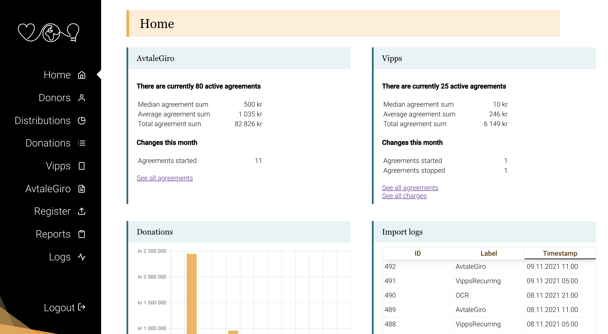
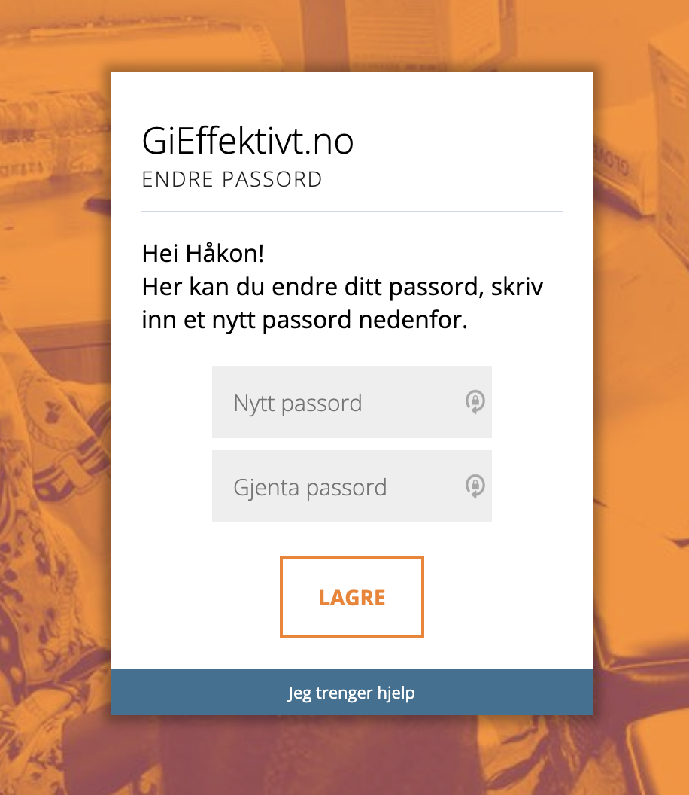
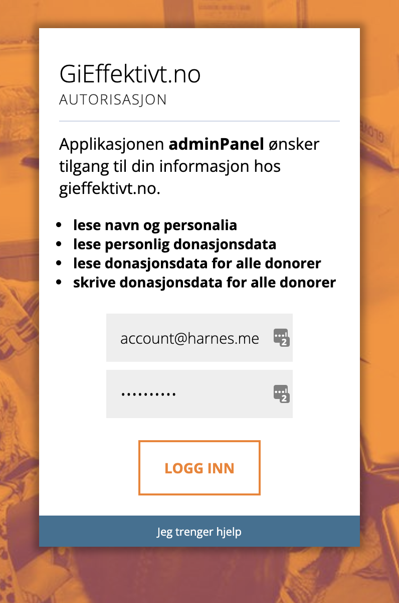

# The Effect foundation Admin panel

The Effect foundation admin panel is a tool used internally in the effect foundation for donation processing and analysis. It aims to make the data in our database accessible and editable by non-technical users. You can view and edit users, view and filter donation distributions, view and filter donations, add new donations and distributions, resend donation reciepts, view and edit recurring donation agreements (Vipps and AvtaleGiro), download reports, view some basic donation statistics and view logs for the automated daily rutines.

Currently, the admin panel is not the source of truth for our donation data. Our google sheet still holds some data not in our database (primarily facebook donations, and historical donations before 2018). It is our goal to eventually retire google sheets, and have all the donation data in the database.



---

**Table of Contents**

- [The Effect foundation Admin panel](#the-effect-foundation-admin-panel)
  - [Getting started](#getting-started)
    - [API](#api)
      - [Permissions](#permissions)
        - [Give your user a password](#give-your-user-a-password)
        - [Make sure your user has access to restricted permissions](#make-sure-your-user-has-access-to-restricted-permissions)
      - [Login](#login)
  - [Code structure and dependencies](#code-structure-and-dependencies)
    - [Components](#components)
    - [Types](#types)
    - [Redux](#redux)
    - [Redux-saga](#redux-saga)
      - [Typescript-fsa](#typescript-fsa)

---

## Getting started

This project is bootstrapped with [create react app](https://create-react-app.dev/).

To run the application, you must first install the dependencies, using npm.

`npm install`

You may then run the application in development mode with the command

`npm start`.

To test and use the application, we need to configure the usage of the api.

### API

The admin panel relies on the common Effect API, found [here](https://github.com/stiftelsen-effekt/effekt-backend). Documentation for this API is scarce at the moment, it's a priority for us to improve this situation.

It's possible to use the admin panel together with the api running locally. Please refer to the API documentation for how to run the API locally.

It's also possible, and easier if you simply want to get up and running, to use the production api or development api.

They are found on these URL's respectively (for Norway):

- https://data.gieffektivt.no
- https://dev.data.gieffektivt.no

You configure which API to use in the [config.ts](src/config/config.ts) file, located in `src/config/config.ts`.

> **Note** The authentification code is configured to redirect to `localhost:3000/#/callback` after a successfull login. It's therefore important that the application runs at this port on localhost. If you are running a local api instance, it cannot run on port 3000.

#### Permissions

> **Note** We expect to transition to [Auth0](https://auth0.com/) authentification in the future, however right now we are using our custom OAuth2 implementation.

To be able to access the restricted routes of the api, you need a user that has the requisite permissions. This is configured in the database.

You need to:

1. Make sure your user has a password
2. Make sure your user has access to restricted permissions

##### Give your user a password

---

To set a password for a user, we can use the reset password feature. First, find your user ID. It's given by the ID in the `Donors` table in the database. Then add a record in the `ChangePass` table in the database. Specify the user id, expiry date and token. The token can be any random string.

```sql
INSERT INTO `EffektDonasjonDB`.`ChangePass` (`userID`, `token`, `expires`) VALUES ('27', '0800fc577294c34e0b28ad2839435945', '2021-11-10');
```

You will then be able to set a password using the change password enpoint, on the dev or prod environment depending on need.

_Prod_ https://data.gieffektivt.no/auth/password/change/0800fc577294c34e0b28ad2839435945

_Dev_ https://dev.data.gieffektivt.no/auth/password/change/0800fc577294c34e0b28ad2839435945

(The token you specified when inserting to the database is the last part of the URL)



##### Make sure your user has access to restricted permissions

---

Some permissions are considered _restricted_, and need to be explicitly granted for each user in the database. This includes the read all donations and write all donations permission. To do this, we need to add some records to the `Access_restricted_permissions` table. You need to add a record for permissions 1 through 4, for your userID.

```sql
INSERT INTO `EffektDonasjonDB`.`Access_restricted_permissions` (`Donor_ID`, `Permission_ID`) VALUES ('27', '1');
INSERT INTO `EffektDonasjonDB`.`Access_restricted_permissions` (`Donor_ID`, `Permission_ID`) VALUES ('27', '2');
INSERT INTO `EffektDonasjonDB`.`Access_restricted_permissions` (`Donor_ID`, `Permission_ID`) VALUES ('27', '3');
INSERT INTO `EffektDonasjonDB`.`Access_restricted_permissions` (`Donor_ID`, `Permission_ID`) VALUES ('27', '4');
```

#### Login

Having given your user a password and the requisite restricted permissions, you should be able to login to the admin panel (provided the permissions were granted for the environment you are using, either `development` or `production`).

After pressing authorize, the backend API will ask if you athorize the adminPanel application to read info about you, read all donation data and write all donation data. After loging in, you are taken to the homepage. A local access key is stored in local storage, and used to fetch an access token when needed to authorize the user for restricted endpoints.

| Press authorize                             | Login with your user                    |
| ------------------------------------------- | --------------------------------------- |
|  |  |

You should be all good to go 🎉

## Code structure and dependencies

The application is built with react and typescript. We use [redux](https://redux.js.org/) for our state and [redux-saga](https://redux-saga.js.org/) for side-effects (mainly http requests to the API). Styling is handled with the css-in-js library [styled-components](https://styled-components.com/).

### Components

Under `src/components` you will find our react components. We use react-router for routing, and the main switch is found in `AdminPanel.tsx`. The side-menu is found in `Naviagtion.tsx`.

The `/login` folder contains a component used in the login flow.

`/modules` houses all reusable components, that are shared (or can be shared) throughout multiple pages.

`/pages` are components housing the different top level pages that are accessible in the side-bar menu.

`/router` houses some simple utility components for routing.

`/style` contains shared styled elements, such as buttons, lists, dropdowns, datepickers etc. that are shared throughout the application.

We use react functional components and hooks in our components.

### Types

We define our types and interfaces in `src/models`.

`state.ts` defines all the redux state models, whilst `types.ts` defines widely used types in the application.

### Redux

We use redux for our state managment. We store both UI state and data in the redux store. To get hold of any part of the store in a react component, we make use of the redux hooks. For example

```typescript
const donations = useSelector((state: AppState) => state.donations.donations);
```

will fetch all the donations currently in the store.

Similarily, actions can be dispatched using a hook as well

```typescript
const dispatch = useDispatch()
(...)
dispatch(fetchDonationsAction.started(undefined))
```

Actions, reducers and sagas are all defined in the `/src/store` folder.

### Redux-saga

Making HTTP requests to our API is naturally a core of the application. This is handled with redux saga. Since side-effects are asynchronous, and the redux store is operated upon synchroenously, we need a library fo handling these HTTP requests.

We handle this by having actions in the flux standard action pattern (more about this below) that initiate side-effects in redux saga.

Concretely, we have a `started`, `failed` and `succeeded` action for any side-effect. Redux-saga listens for `started` actions, carries out the side-effect (http call or otherwise) and emits either the `failed` or `succeeded` action. The actions saga listens for are defined in the `/src/root.saga.ts` file.

The sagas themselves are defined in the `/src/store` folder, where they belong in the store structure. Usually they call the API and return the result. They utilize the `/src/util/api.ts` class to make the API calls. This class simplifies some of the logic pertaining to authentification, such as automatic fetching of a new access token if it is expired, and automatic retries.

#### Typescript-fsa

When creating actions for redux-saga, we use the flux standard action pattern. We have used a package called typescript-fsa, however this package is no longer being maintained. We should create our own version of this action factory pattern in the future, as referenced in [issue #155](https://github.com/stiftelsen-effekt/effekt-admin/issues/155).
